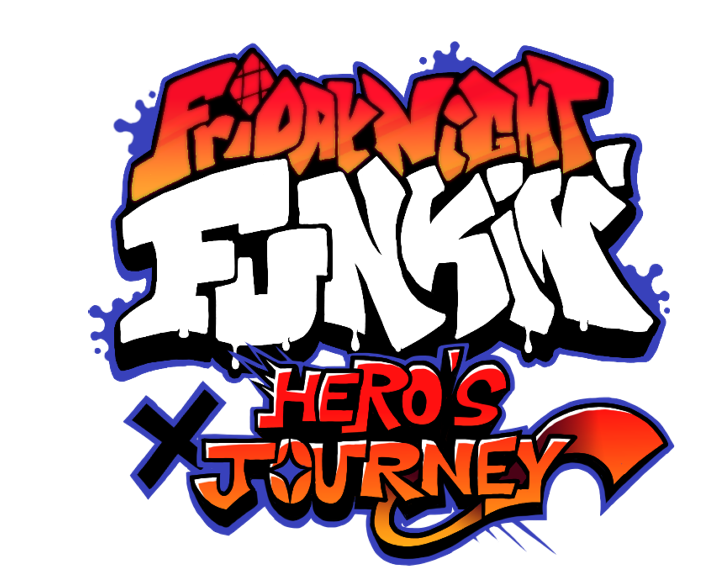

# Friday Night Funkin': Hero's Journey

A mod in the making for months, Hero's Journey has two weeks, 6 songs and entirely new characters and stages! This github hosts the history of Kayya and Wizz's work programming the mod, as well as lets anyone who wants look at the code and see how we did anything specific.

This mod was built off of Kade Engine 1.5.2.

# Credits
## Friday Night Funkin': Hero's Journey
- [Oneil R.](https://oneilr.newgrounds.com) - Project leader, artist, animator, charter
- [Kayya](https://ashatelethia.newgrounds.com) - Project Co-leader, programmer, loremaster
- [Saruky](https://saruky.newgrounds.com) - Composer for Week 1
- [Wizzkidwas](https://twitter.com/wizzkidwas) - Main programmer
- [Fueg0](https://www.youtube.com/channel/UC8udDz2kZJREgNfS8T4iuHg) - Composer for Week 2

### Kade Engine

- [KadeDeveloper](https://twitter.com/KadeDeveloper) - Maintainer and lead programmer
